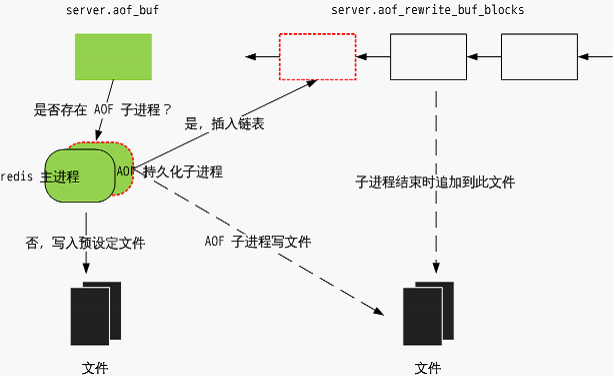
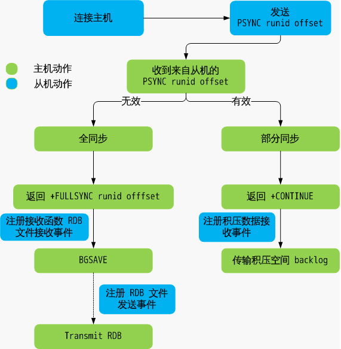

# micro-service communication
简短来说, 微服务架构是一种以一些微服务来替代开发单个大而全应用的方法, 每一个小服务运行在自己的进程里,并以轻量级的机制来通信, 通常是 HTTP RESTful API. 微服务强调小快灵, 任何一个相对独立的功能服务不再是一个模块, 而是一个独立的服务.

- 架构风格(architecture style)
- 传输协议(transport protocol)
    - rest over https
    - message broker 
    - RPC(remote procedure call)
        - 没有单点故障 -> 排除消息队列传递
        - 错误返回给调用者/客户端/消费者
        - 提供原生体验的服务接口

# redis
1. 使用Redis有哪些好处？
(1) 速度快，因为数据存在内存中，类似于HashMap，HashMap的优势就是查找和操作的时间复杂度都是O(1) 
(2) 支持丰富数据类型，支持string，list，set，sorted set，hash 
(3) 支持事务，操作都是原子性，所谓的原子性就是对数据的更改要么全部执行，要么全部不执行 
(4) 丰富的特性：可用于缓存，消息，按key设置过期时间，过期后将会自动删除

2. Redis提供了哪几种持久化方式？
- RDB持久化方式能够在指定的时间间隔能对你的数据进行快照存储.

- AOF持久化方式记录每次对服务器写的操作,当服务器重启的时候会重新执行这些命令来恢复原始的数据,AOF命令以redis协议追加保存每次写的操作到文件末尾.Redis还能对AOF文件进行后台重写,使得AOF文件的体积不至于过大.

- 如果你只希望你的数据在服务器运行的时候存在,你也可以不使用任何持久化方式.

- 你也可以同时开启两种持久化方式, 在这种情况下, 当redis重启的时候会优先载入AOF文件来恢复原始的数据,因为在通常情况下AOF文件保存的数据集要比RDB文件保存的数据集要完整.

- 最重要的事情是了解RDB和AOF持久化方式的不同,让我们以RDB持久化方式开始。

3. Redis的同步机制了解么？

Redis可以使用主从同步，从从同步。第一次同步时，主节点做一次bgsave，并同时将后续修改操作记录到内存buffer，待完成后将rdb文件全量同步到复制节点，复制节点接受完成后将rdb镜像加载到内存。加载完成后，再通知主节点将期间修改的操作记录同步到复制节点进行重放就完成了同步过程。

4. 是否使用过Redis集群，集群的原理是什么？

Redis Sentinal着眼于高可用，在master宕机时会自动将slave提升为master，继续提供服务。

Redis Cluster着眼于扩展性，在单个redis内存不足时，使用Cluster进行分片存储。

5. Redis如何做持久化的？

bgsave做镜像全量持久化，aof做增量持久化。因为bgsave会耗费较长时间，不够实时，在停机的时候会导致大量丢失数据，所以需要aof来配合使用。在redis实例重启时，会使用bgsave持久化文件重新构建内存，再使用aof重放近期的操作指令来实现完整恢复重启之前的状态。

对方追问那如果突然机器掉电会怎样？取决于aof日志sync属性的配置，如果不要求性能，在每条写指令时都sync一下磁盘，就不会丢失数据。但是在高性能的要求下每次都sync是不现实的，一般都使用定时sync，比如1s1次，这个时候最多就会丢失1s的数据。

对方追问bgsave的原理是什么？你给出两个词汇就可以了，fork和cow。fork是指redis通过创建子进程来进行bgsave操作，cow指的是copy on write，子进程创建后，父子进程共享数据段，父进程继续提供读写服务，写脏的页面数据会逐渐和子进程分离开来。

6. 使用过Redis做异步队列么，你是怎么用的？

一般使用list结构作为队列，rpush生产消息，lpop消费消息。当lpop没有消息的时候，要适当sleep一会再重试。

如果对方追问可不可以不用sleep呢？list还有个指令叫blpop，在没有消息的时候，它会阻塞住直到消息到来。

如果对方追问能不能生产一次消费多次呢？使用pub/sub主题订阅者模式，可以实现1:N的消息队列。

如果对方追问pub/sub有什么缺点？在消费者下线的情况下，生产的消息会丢失，得使用专业的消息队列如rabbitmq等。

7. 如果这个redis正在给线上的业务提供服务，那使用keys指令会有什么问题？

这个时候你要回答redis关键的一个特性：redis的单线程的。keys指令会导致线程阻塞一段时间，线上服务会停顿，直到指令执行完毕，服务才能恢复。这个时候可以使用scan指令，scan指令可以无阻塞的提取出指定模式的key列表，但是会有一定的重复概率，在客户端做一次去重就可以了，但是整体所花费的时间会比直接用keys指令长。

8. Redis有哪些数据结构？

字符串String、字典Hash、列表List、集合Set、有序集合SortedSet。
   
9. 淘汰机制
- volatile-lru：从已设置过期时间的数据集（server.db[i].expires）中挑选最近最少使用 的数据淘汰
- volatile-ttl：从已设置过期时间的数据集（server.db[i].expires）中挑选将要过期的数 据淘汰
- volatile-random：从已设置过期时间的数据集（server.db[i].expires）中任意选择数据 淘汰
- allkeys-lru：从数据集（server.db[i].dict）中挑选最近最少使用的数据淘汰
- allkeys-random：从数据集（server.db[i].dict）中任意选择数据淘汰
- no-enviction（驱逐）：禁止驱逐数据
10. RDB 持久化策略
为防止数据丢失，需要将 Redis 中的数据从内存中 dump 到磁盘，这就是**持久化**。Redis 提供两种持久化方式：RDB 和 AOF。Redis 允许两者结合，也允许两者同时关闭。
- RDB 可以定时备份内存中的数据集。服务器启动的时候，可以从 RDB 文件中恢复数据集。

- AOF(append only file) 可以记录服务器的所有写操作。在服务器重新启动的时候，会把所有的写操作重新执行一遍，从而实现数据备份。当写操作集过大（比原有的数据集还大），Redis 会重写写操作集。
- Redis 支持两种方式进行 RDB 持久化：当前进程执行和后台执行（BGSAVE）。RDB BGSAVE 策略是 fork 出一个子进程，把内存中的数据集整个 dump 到硬盘上。两个场景举例：

Redis 服务器初始化过程中，设定了定时事件，每隔一段时间就会触发持久化操作； 进入定时事件处理程序中，就会 fork 产生子进程执行持久化操作。
Redis 服务器预设了 save 指令，客户端可要求服务器进程中断服务，执行持久化操作。
- 如果采用 BGSAVE 策略，且内存中的数据集很大，fork() 会因为要为子进程产生一份虚拟空间表而花费较长的时间；如果此时客户端请求数量非常大的话，会导致较多的写时拷贝操作；在 RDB 持久化操作过程中，每一个数据都会导致 write() 系统调用，CPU 资源很紧张。因此，如果在一台物理机上部署多个 Redis，应该避免同时持久化操作。

**AOF 持久化和 RDB 持久化的最主要区别在于，前者记录了数据的变更，而后者是保存了数据本身。本篇主要讲的是AOF 持久化，了解 AOF 的数据组织方式和运作机制。Redis 主要在 aof.c 中实现 AOF 的操作。**

和 redis RDB 持久化运作机制不同，redis AOF 有后台执行和边服务边备份两种方式。
- 1）AOF 后台执行的方式和 RDB 有类似的地方，fork 一个子进程，主进程仍进行服务，子进程执行AOF 持久化，数据被dump 到磁盘上。与 RDB 不同的是，后台子进程持久化过程中，主进程会记录期间的所有数据变更（主进程还在服务），并存储在 server.aof_rewrite_buf_blocks 中；后台子进程结束后，Redis 更新缓存追加到 AOF 文件中，是 RDB 持久化所不具备的。
- 2）边服务边备份的方式，即 Redis 服务器会把所有的数据变更存储在 server.aof_buf 中，并在特定时机将更新缓存写入预设定的文件（server.aof_filename）。特定时机有三种：
    - 进入事件循环之前
    - Redis 服务器定时程序 serverCron() 中
    - 停止 AOF 策略的 stopAppendOnly() 中

- 订阅发布机制
    - channel机制订阅
    - glob-style 模式
        - 模式频道订阅是一个 list。当有消息发布的时候，channel 与 glob-style pattern 匹配，发布消息。
- master-slave 
简单来说，主从同步就是 RDB 文件的上传下载；主机有小部分的数据修改，就把修改记录传播给每个从机。这篇文章详述了 Redis 主从复制的内部协议和机制。

- redis event
- Redis 事务简述
    MULTI，EXEC，DISCARD，WATCH 四个命令是 Redis 事务的四个基础命令。其中：
    * MULTI，告诉 Redis 服务器开启一个事务。注意，只是开启，而不是执行
    * EXEC，告诉 Redis 开始执行事务
    * DISCARD，告诉 Redis 取消事务
    * WATCH，监视某一个键值对，它的作用是在事务执行之前如果监视的键值被修改，事务会被取消。
- redis cluster
    - consistent hashing 
        - 通常，业务量较大的时候，考虑到性能的问题（索引速度慢和访问量过大），不会把所有的数据存放在一个 Redis 服务器上。这里需要将一堆的键值均分存储到多个 Redis 服务器，可以通过hash算法。
        - 一致性哈希算法，既可以在客户端实现，也可以在中间件上实现（如 proxy）。在客户端实现中，当客户端初始化的时候，需要初始化一张预备的 Redis 节点的映射表：hash(key)=> . 这有一个缺点，假设有多个客户端，当映射表发生变化的时候，多个客户端需要同时拉取新的映射表。

        - 另一个种是中间件（proxy）的实现方法，即在客户端和 Redis 节点之间加多一个代理，代理经过哈希计算后将对应某个key 的请求分发到对应的节点，一致性哈希算法就在中间件里面实现。可以发现，twemproxy 就是这么做的。
        - redis cluster 就是想要让一群的节点实现自治，有自我修复的功能，数据分片和负载均衡。    
- high concurrency
    - 并发:你有处理多个任务的能力,不一定同时(一个CPU轮流)

    * 并行:有同时处理多个任务的能力(多个CPU同时)

    * 并发和并行都可以是很多个线程,就看这些线程能不能同时被(多个)CPU执行,可以说明是并行,并发是多个线程被一个CPU轮流切换着执行

- mysql locks:
* （１）共享读锁（S）之间是兼容的，但共享读锁（S）和排他写锁（X）之间，以及排他写锁之间（X）是互斥的，也就是说读和写是串行的。
* （２）在一定条件下，ＭyISAM允许查询和插入并发执行，我们可以利用这一点来解决应用中对同一表和插入的锁争用问题。
* （３）ＭyISAM默认的锁调度机制是写优先，这并不一定适合所有应用，用户可以通过设置LOW_PRIPORITY_UPDATES参数，或在INSERT、UPDATE、DELETE语句中指定LOW_PRIORITY选项来调节读写锁的争用。
* （４）由于表锁的锁定粒度大，读写之间又是串行的，因此，如果更新操作较多，ＭyISAM表可能会出现严重的锁等待，可以考虑采用InnoDB表来减少锁冲突。

- lock types
  相对其他数据库而言，MySQL的锁机制比较简单，其最显著的特点是不同的存储引擎支持不同的锁机制。
  MySQL大致可归纳为以下3种锁：
* 表级锁：开销小，加锁快；不会出现死锁；锁定粒度大，发生锁冲突的概率最高，并发度最低。
* 行级锁：开销大，加锁慢；会出现死锁；锁定粒度最小，发生锁冲突的概率最低，并发度也最高。
* 页面锁：开销和加锁时间界于表锁和行锁之间；会出现死锁；锁定粒度界于表锁和行锁之间，并发度一般
  当一个线程获得对一个表的写锁后，只有持有锁线程可以对表进行更新操作。其他线程的读、写操作都会等待，直到锁被释放为止。

   可见，对ＭyISAM表的读操作，不会阻塞其他用户对同一表的读请求，但会阻塞对同一表的写请求；对ＭyISAM表的写操作，则会阻塞其他用户对同一表的读和写请求；ＭyISAM表的读和写操作之间，以及写和写操作之间是串行的！**当一线程获得对一个表的写锁后，只有持有锁的线程可以对表进行更新操作。其他线程的读、写操作都会等待，直到锁被释放为止。**

   MyISAM存储引擎的读和写锁是互斥，读操作是串行的。那么，一个进程请求某个MyISAM表的读锁，同时另一个进程也请求同一表的写锁，MySQL如何处理呢？答案是写进程先获得锁。不仅如此，即使读进程先请求先到锁等待队列，写请求后到，写锁也会插到读请求之前！这是因为MySQL认为写请求一般比读请求重要。这也正是MyISAM表不太适合于有大量更新操作和查询操作应用的原因，因为，大量的更新操作会造成查询操作很难获得读锁，从而可能永远阻塞。

- 对于InnoDB表，主要有以下几点
    * （１）InnoDB的行销是基于索引实现的，如果不通过索引访问数据，InnoDB会使用表锁。
    * （２）InnoDB间隙锁机制，以及InnoDB使用间隙锁的原因。
    * （３）在不同的隔离级别下，InnoDB的锁机制和一致性读策略不同。
    * （４）ＭySQL的恢复和复制对InnoDB锁机制和一致性读策略也有较大影响。
    * （５）锁冲突甚至死锁很难完全避免。
    在了解InnoDB的锁特性后，用户可以通过设计和SQL调整等措施减少锁冲突和死锁，包括：
        尽量使用较低的隔离级别
        精心设计索引，并尽量使用索引访问数据，使加锁更精确，从而减少锁冲突的机会。
        选择合理的事务大小，小事务发生锁冲突的几率也更小。
        给记录集显示加锁时，最好一次性请求足够级别的锁。比如要修改数据的话，最好直接申请排他锁，而不是先申请共享锁，修改时再请求排他锁，这样容易产生死锁。
        不同的程序访问一组表时，应尽量约定以相同的顺序访问各表，对一个表而言，尽可能以固定的顺序存取表中的行。这样可以大减少死锁的机会。
        尽量用相等条件访问数据，这样可以避免间隙锁对并发插入的影响。
        不要申请超过实际需要的锁级别；除非必须，查询时不要显示加锁。
        对于一些特定的事务，可以使用表锁来提高处理速度或减少死锁的可能。
**The default engine of MySql is InnoDb.**
- 对于ＭyISAM的表锁，主要有以下几点
    * （１）共享读锁（S）之间是兼容的，但共享读锁（S）和排他写锁（X）之间，以及排他写锁之间（X）是互斥的，也就是说读和写是串行的。
    * （２）在一定条件下，ＭyISAM允许查询和插入并发执行，我们可以利用这一点来解决应用中对同一表和插入的锁争用问题。
    * （３）ＭyISAM默认的锁调度机制是写优先，这并不一定适合所有应用，用户可以通过设置LOW_PRIPORITY_UPDATES参数，或在INSERT、UPDATE、DELETE语句中指定LOW_PRIORITY选项来调节读写锁的争用。
    * （４）由于表锁的锁定粒度大，读写之间又是串行的，因此，如果更新操作较多，ＭyISAM表可能会出现严重的锁等待，可以考虑采用InnoDB表来减少锁冲突。

- InnoDB的行锁是针对索引加的锁，不是针对记录加的锁。并且该索引不能失效，否则都会从行锁升级为表锁。
- 什么场景下用表锁
    InnoDB默认采用行锁，在未使用索引字段查询时升级为表锁。MySQL这样设计并不是给你挖坑。它有自己的设计目的。
    即便你在条件中使用了索引字段，MySQL会根据自身的执行计划，考虑是否使用索引(所以explain命令中会有possible_key 和 key)。如果MySQL认为全表扫描效率更高，它就不会使用索引，这种情况下InnoDB将使用表锁，而不是行锁。因此，在分析锁冲突时，别忘了检查SQL的执行计划，以确认是否真正使用了索引。

* 第一种情况：全表更新。事务需要更新大部分或全部数据，且表又比较大。若使用行锁，会导致事务执行效率低，从而可能造成其他事务长时间锁等待和更多的锁冲突。

* 第二种情况：多表级联。事务涉及多个表，比较复杂的关联查询，很可能引起死锁，造成大量事务回滚。这种情况若能一次性锁定事务涉及的表，从而可以避免死锁、减少数据库因事务回滚带来的开销。

- 行锁优化
1. 尽可能让所有数据检索都通过索引来完成，避免无索引行或索引失效导致行锁升级为表锁。
2. 尽可能避免间隙锁带来的性能下降，减少或使用合理的检索范围。
3. 尽可能减少事务的粒度，比如控制事务大小，而从减少锁定资源量和时间长度，从而减少锁的竞争等，提供性能。
4. 尽可能低级别事务隔离，隔离级别越高，并发的处理能力越低。

- 表锁
* 表锁的优势：开销小；加锁快；无死锁
* 表锁的劣势：锁粒度大，发生锁冲突的概率高，并发处理能力低
* 加锁的方式：自动加锁。查询操作（SELECT），会自动给涉及的所有表加读锁，更新操作（UPDATE、DELETE、INSERT），会自动给涉及的表加写锁。也可以显示加锁：
* 共享读锁：lock table tableName read;
* 独占写锁：lock table tableName write;
* 批量解锁：unlock tables;

- InnoDB实现了以下两种类型的行锁。
* 共享锁（S）：允许一个事务去读一行，阻止其他事务获得相同数据集的排他锁。
* 排他锁（X)：允许获得排他锁的事务更新数据，阻止其他事务取得相同数据集的共享读锁和排他写锁。另外，为了允许行锁和表锁共存，实现多粒度锁机制，InnoDB还有两种内部使用的意向锁（Intention Locks），这两种意向锁都是表锁。
* 意向共享锁（IS）：事务打算给数据行加行共享锁，事务在给一个数据行加共享锁前必须先取得该表的IS锁。
* 意向排他锁（IX）：事务打算给数据行加行排他锁，事务在给一个数据行加排他锁前必须先取得该表的IX锁。

InnoDB行锁是通过给索引上的索引项加锁来实现的，只有通过索引条件检索数据，InnoDB才使用行级锁，否则，InnoDB将使用表锁！

- 高并发技术的核心是分流；
    - 分别针对请求的各个环节，根据具体场景和业务特点采用不同的分流方案，逐层逐级的分担系统压力，从而达到高并发能力。

- 常见的高并发技术有：动静分离、缓存、异步并发、水平扩展等。分流简单来说就是：一台服务器承担不了的流量，就让多台服务器共同分担；DB承担不了流量就让缓存来帮忙分担；等等。接下来讨论的所有内容都是围绕着分流来实现的。
  
- 一次请求主要分为四个阶段：
    - 客户端发起请求；
    - 通过网络将请求信息发送到服务端；
    - 服务端处理请求；
    - 服务端将结果返回给客户端。

- 客户端优化技术
客户端优化技术主要指的是客户端通过缓存数据，减少访问服务端的次数，以实现降低服务端压力，达到支持更多并发量的需求。

常见的处理方式是：缓存不经常变动的内容，每隔一定时间更新一次，或者除非修改了否则较长时间不更新；如：更新微信公众账号的头像时，手机端不会立即看到这个更新。另外，根据业务场景可以限制不必要的请求；如：点击一个按钮，发送一次请求到服务端时，禁用按钮，避免因用户多次点击，而发送不必要的请求。

- 网络优化技术
网络优化的核心目标是：将资源缓存到距离用户最近的网络节点上，这样除了可以省下大量网络带宽外，还可以达到最快的请求速度；一般针对静态资源。

通过静态化技术（将不经常变动的内容生成静态文件）或动静分离技术（例如H5+ajax），将静态的内容存储在CDN上，当用户查看一个页面时，只让少数的动态请求落到服务器端，其他内容从CDN上直接获取，这样就可以极大的减少服务器端的流量。

- 服务端优化技术
    - 负载均衡
    负载均衡的核心是让每台服务器以一个合适的负载来分担所有的请求。

    常见的负载均衡方案有：随机、轮询、hash、一致性hash。当然在这些基础上有很多扩展，例如在负载均衡的机器中设置不同的权重；根据key的范围不同调用不同的服务器等等。
    - 缓存
        - 高效原因
            - 缓存的结构一般都是key-value结构，通过key直接寻址，时间复杂度为O(1)，这比DB的遍历比较来快了非常多；另外，不少的缓存中间件通过在内存中存储数据，不用从磁盘中获取数据，性能也就会非常高。

            说明一下：大部分缓存中间件都会对value做一些扩充，让value也成为一个复杂的数据结构，例如Redis的Set、SortSet，如果需要在value中寻找某一个值，时间复杂度会退化成为O(N)；这些数据结构提供了强大的功能，使用的时候注意合理使用，以避免因为缓存乱用导致性能降低的问题。
        - 分布式缓存
            - 如redis、tair、memcached等。

            优点是：集群部署，不用考虑容量问题，数据支持持久化，支持高可用。

            缺点是：因为服务器和缓存数据交换时存在一次网络交互，如果数据结构选择不合理或者并发量非常大或者每次交互的数据量较大时，可能会引起io阻塞等问题，需谨慎。
        - 堆缓存
            - 通过java的堆来缓存数据。

                优点是：速度非常快。

                缺点是：存储数据量受限，断点数据丢失，分布式场景中如果出现不一致时，处理麻烦。
        - 磁盘文件缓存
            将数据存储到服务器所在的磁盘上。

            优点是：存储内容较堆内存多（少于分布式缓存），是持久化的。

            缺点是：服务器迁移时也要迁移磁盘中的文件，分布式场景中如果出现不一致时，处理麻烦。
    - 通信模型
        - 高性能的IO通信模型可以给系统带来巨大的性能提升。目前就较为成熟、高效的IO通行模型是NIO（也叫IO多路复用、异步阻塞IO）。
        - 在 java 服务器前加一层 Nginx 服务器，它既可以提供良好的负载均衡能力，也能够支持非常高的并发。当然Nginx 的高性能还与他的 master-worker设计有关，几乎做到了无线程切换。
        使用Dubbo进行RPC调用时，默认使用的Netty也是基于NIO的。
    - 队列技术
        - 队列技术的作用是将同步转化成异步；相比于同步，异步可以根据服务器的处理能力来消化这些请求；同步则是不顾忌服务器的承受能力，所有请求一起蜂拥而入。
        常见的技术有MQ消息服务器，例如RocketMQ、RabbitMQ、kafka；其中RocketMQ和kafka都可以支持非常大的并发量和消息量，性能非常的好。
    - 线程池
        - 线程池是一种很实用的提升系统的服务能力的方案，其思路就是一个线程处理的慢，那创建一堆线程出来处理，速度自然就快了；线程池还有另外一个优点，重复利用连接，降低创建成本。线程池大小的设置一般参考一下两点：高并发、任务执行时间短的任务，线程池线程数可以设置为CPU核数，减少线程上下文的切换；主要针对cpu密集型任务。例如：nginx中worker线程的数目。
    - DB存储
        DB一般是服务端性能的瓶颈，所以对DB的优化方式也比较多，整理起来主要有以下几种：
        表级别性能优化，例如：单表操作，避免联表操作；使用索引；事务尽可能短；查询优化；等等。
        读写分离。
        分库分表；分区（注意不合适的分区策略不但不能提升性能，反而可能降低性能）。
    - 响应优化技术
        返回结果优化主要是压缩返回结果，通过降低字节长度来降低网络消耗。分多次加载数据，每次只显示一屏数据。
        这种技术在静态内容中使用的比较多，例如压缩javascript、css文件等，动态请求中使用的不多。
    

spark: https://my.oschina.net/sunzy/blog/1617071

redis:http://wiki.jikexueyuan.com/project/redis/transaction-mechanism.html